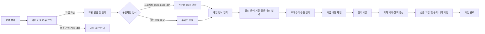
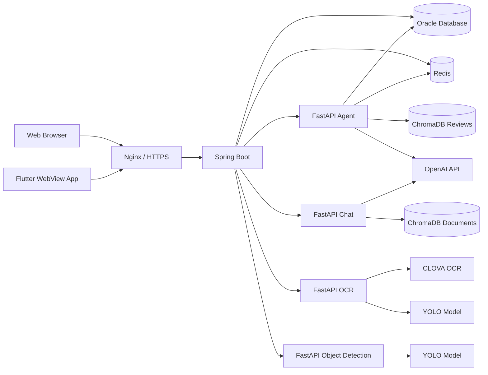

# fx_bank
부산은행 부트캠프 - 외환 2차 프로젝트
<div align="center">

# 💱 KLS Bank

### 외환 상품 탐색부터 환율 조회, 본인인증, 상품 가입, AI 추천까지 연결한 통합 디지털 외환 플랫폼

[](https://www.java.com/)
[](https://spring.io/projects/spring-boot)
[](https://www.python.org/)
[](https://fastapi.tiangolo.com/)
[](https://www.oracle.com/database/)
[](https://redis.io/)
[](https://flutter.dev/)
[](https://www.docker.com/)

<br>

[🌐 KLS Bank 배포 사이트](https://klsbank.store/)

</div>

---

## 1. 프로젝트 소개

**KLS Bank**는 외환 상품과 환율 정보를 한곳에서 확인하고, 사용자 인증부터 실제 외화 상품 가입까지 진행할 수 있도록 구현한 금융 서비스 프로젝트입니다.

Spring Boot를 중심으로 회원·상품·환율·가입 데이터를 처리하고, 기능별 FastAPI 서버를 분리하여 신분증 OCR, AI 상품 추천, 리뷰 감성 분석, RAG 챗봇, 객체 탐지를 연동했습니다. Flutter 앱에서는 배포된 웹 서비스를 WebView로 제공하면서 모바일 카메라와 웹 가입 화면을 연결했습니다.

| 구분 | 내용 |
|---|---|
| 프로젝트명 | KLS Bank 외환 서비스 |
| 개발 기간 | 2026.06 ~ 2026.07.01 |
| 개발 형태 | 부산은행 부트캠프 외환 2차 팀 프로젝트 |
| 팀 구성 | 5명 |
| 서비스 형태 | 반응형 Web + Flutter WebView App |
| 배포 환경 | Oracle Cloud VM, Docker Compose, Nginx, HTTPS |
| 배포 주소 | https://klsbank.store/ |

> 본 프로젝트는 교육 목적으로 제작된 포트폴리오 프로젝트이며 실제 은행의 공식 금융 서비스가 아닙니다.

---

## 2. 기획 배경

외환 서비스는 환율 정보 제공만으로 끝나지 않고 다음 절차가 하나의 흐름으로 연결되어야 합니다.

- 사용자 인증과 민감정보 보호
- 상품 유형별 가입 조건 확인
- 약관 열람과 필수 동의 검증
- 신분증 OCR 또는 휴대폰 본인인증
- 가입 금액·기간·통화·출금 계좌 입력
- 우대금리 쿠폰 적용
- 전자서명과 가입 내역 저장
- 외화 계좌 생성과 잔액 처리

KLS Bank는 이 과정을 사용자가 끊김 없이 진행할 수 있도록 구현하고, AI 분석과 모바일 카메라 연동을 추가하여 개인화된 디지털 외환 서비스 경험을 제공하는 것을 목표로 했습니다.

---

## 3. 주요 기능

### 3.1 회원가입·로그인·보안

- 신분증 이미지 업로드를 통한 회원가입 정보 입력 보조
- BCrypt 기반 비밀번호 단방향 암호화
- JWT Access Token·Refresh Token 발급
- Redis를 이용한 Refresh Token 및 사용자 정보 캐싱
- Refresh Token Rotation 방식의 토큰 재발급
- 로그아웃된 Access Token의 Redis 블랙리스트 처리
- 주민등록번호 AES-256-GCM 암호화 및 마스킹 저장
- 민감정보 보관 만료 확인 및 재인증 처리

### 3.2 외환 상품 조회

- 외화예금·외화적금 상품 목록 조회
- 상품 유형과 키워드 기반 검색·필터링
- 페이지 단위 상품 조회
- 상품별 가입 가능 통화, 기본금리, 기간별 금리, 우대금리 확인
- 상품 약관 PDF 열람
- 상품 리뷰 조회 및 가입 사용자 리뷰 작성
- 내 가입 상품 및 외화 계좌 조회

### 3.3 외화 상품 가입

- 가입 전 중복 가입 및 출금 가능 계좌 확인
- 필수·선택 약관 구분과 필수 약관 전체 동의 검증
- 상품 유형과 사용자 활동 이력에 따른 본인확인 방식 분기
- 신분증 OCR 결과와 로그인 회원 정보 비교
- 휴대폰 인증번호 발송 및 검증
- 통화·가입 금액·기간·출금 계좌·계좌 비밀번호 입력
- 우대금리 쿠폰 적용 및 최고금리 초과 방지
- Canvas 기반 전자서명 이미지 저장
- 외화 계좌, 통화별 잔액, 상품 가입 내역, 약관 동의 내역을 하나의 트랜잭션으로 저장
- 가입 진행 상태 임시 저장 및 이어서 가입

### 3.4 환율 조회·환전 계산

- 한국수출입은행 환율 OpenAPI 연동
- 매일 고시환율 자동 수집 및 미수집 데이터 재시도 스케줄링
- 최신 환율과 통화별 과거 환율 조회
- 주요 통화 환율 카드 제공
- 외화 구매·판매 구분에 따른 적용 환율 계산
- 환율 우대율을 반영한 예상 원화 금액과 절감액 계산

### 3.5 AI·OCR 서비스

| 서비스 | 주요 역할 |
|---|---|
| `fastapi-ocr` | YOLO로 신분증 주요 영역을 탐지한 뒤 CLOVA OCR로 이름·주민번호·주소·발급일 추출 |
| `fastapi-agent` | 상품 리뷰 감성·키워드·상품 성향 분석, 사용자 행동 기반 금융 MBTI와 상품 추천 |
| `fastapi-chat` | 외환 안내 PDF를 ChromaDB에 임베딩하고 RAG 방식으로 상담 답변 생성 |
| `fastapi-bnk` | 이벤트 이미지에서 지정 문자를 탐지하는 YOLO 객체 탐지 서버 |

### 3.6 관리자 기능

- 약관 관리 대상 상품 목록과 상세 조회
- 상품별 약관 등록
- 약관 PDF 저장 및 텍스트 추출
- 약관 버전 자동 증가 및 기존 버전 만료 처리
- 약관 변경 사유와 버전 이력 조회
- 특정 시점에 적용된 약관 버전 추적

### 3.7 Flutter WebView 앱

- 배포 사이트를 Android WebView로 제공
- KLS Bank 스플래시 화면 적용
- 앱 전용 헤더·푸터·모바일 내비게이션 UI 제어
- JavaScript Channel을 이용한 웹과 Flutter 통신
- 이벤트 촬영 및 신분증 촬영 카메라 연동
- Android 파일 선택 요청을 카메라·갤러리와 연결
- 태블릿 환경에서 모바일 화면 폭을 유지하도록 반응형 처리

---

## 4. 상품 가입 프로세스



### 프로젝트에 적용한 본인확인 분기

- 입출금이 자유로운 외화예금: 가입 시 신분증 OCR 인증
- 정기예금·적금: 기본적으로 휴대폰 인증
- 최근 1년간 금융상품 활동이 없는 사용자: 추가 신분증 OCR 인증

> 위 분기는 프로젝트에서 정의한 업무 규칙입니다. 실제 금융기관의 고객확인 절차는 관련 법령과 각 기관의 내부 정책에 따라 달라질 수 있습니다.

---

## 5. 시스템 아키텍처



### 서비스 포트

| 서비스 | 내부 포트 | 역할 |
|---|---:|---|
| Spring Boot | `8080` | 메인 웹·REST API 서버 |
| FastAPI Agent | `8000` | 리뷰 분석·금융 MBTI·상품 추천 |
| FastAPI Object Detection | `8001` | 이벤트 객체 탐지 |
| FastAPI Chat | `8002` | RAG 외환 상담 챗봇 |
| FastAPI OCR | `8003` | 신분증 OCR |
| Redis | `6379` | 토큰·사용자 캐시 |
| Nginx | `80`, `443` | 리버스 프록시·HTTPS |

---

## 6. 기술 스택

| 영역 | 기술 |
|---|---|
| Frontend | Thymeleaf, HTML5, CSS3, JavaScript |
| Mobile | Flutter, Dart, WebView, Image Picker |
| Backend | Java 21, Spring Boot 3.3.4, Spring Security, Validation |
| Persistence | Oracle Database, MyBatis, Oracle Wallet |
| Authentication | JWT, BCrypt, Redis, AES-256-GCM |
| AI Backend | Python, FastAPI, Uvicorn |
| AI·LLM | OpenAI API, LangChain, ChromaDB, RAG |
| Vision·OCR | Ultralytics YOLO, OpenCV, CLOVA OCR |
| External API | 한국수출입은행 환율 OpenAPI, SOLAPI SMS |
| Infra | Oracle Cloud, Docker, Docker Compose, Nginx, Let's Encrypt |
| Build | Gradle, pip, Flutter SDK |

---

## 7. 프로젝트 구조

```text
fx_bank-main/
├── spring-server/
│   └── fx_bank/                 # Spring Boot 메인 서버
│       ├── src/main/java/       # Controller, Service, DAO, DTO, Security
│       ├── src/main/resources/
│       │   ├── mapper/          # MyBatis XML Mapper
│       │   ├── templates/       # Thymeleaf 화면
│       │   └── static/          # CSS, JavaScript
│       ├── build.gradle
│       └── Dockerfile
├── fastapi-agent/               # 리뷰 분석·금융 MBTI·상품 추천
├── fastapi-bnk/                 # 이벤트 YOLO 객체 탐지
├── fastapi-chat/                # 외환 문서 RAG 챗봇
├── fastapi-ocr/                 # 신분증 YOLO + CLOVA OCR
├── flutter/
│   └── bnk_app/                 # WebView 기반 Android 앱
├── nginx/
│   └── nginx.conf               # HTTPS 리버스 프록시
├── docker-compose.yml
└── README.md
```

---

## 8. 주요 API

### 인증

| Method | Endpoint | 설명 |
|---|---|---|
| `POST` | `/api/auth/ocr/id-card` | 회원가입용 신분증 OCR |
| `GET` | `/api/auth/check-id` | 아이디 중복 확인 |
| `POST` | `/api/auth/register` | 회원가입 |
| `POST` | `/api/auth/login` | 로그인 및 토큰 발급 |
| `POST` | `/api/auth/refresh` | Access·Refresh Token 재발급 |
| `POST` | `/api/auth/logout` | 로그아웃 및 토큰 무효화 |
| `POST` | `/api/auth/reauth` | 만료된 민감정보 재인증 |

### 환율

| Method | Endpoint | 설명 |
|---|---|---|
| `GET` | `/api/fx/rates/main` | 메인 대표 환율 조회 |
| `GET` | `/api/fx/rates/latest` | 최신 환율 조회 |
| `GET` | `/api/fx/rates` | 통화별 환율 이력 조회 |
| `GET` | `/api/fx/calc` | 우대율 반영 환전 금액 계산 |

### 상품·가입

| Method | Endpoint | 설명 |
|---|---|---|
| `GET` | `/products` | 외환 상품 목록 |
| `GET` | `/product/detail/{productNo}` | 상품 상세 |
| `GET` | `/api/product/join/{productNo}/join-eligibility` | 가입 가능 여부 확인 |
| `GET` | `/api/product/join/{productNo}/identity-verification-requirement` | 본인확인 방식 확인 |
| `POST` | `/api/product/join/terms` | 약관 동의 저장 |
| `POST` | `/api/product/join/{productNo}/ocr` | 상품 가입 신분증 OCR 인증 |
| `POST` | `/api/product/join/{productNo}/phone-verification/send` | 휴대폰 인증번호 발송 |
| `POST` | `/api/product/join/form` | 가입 정보 임시 저장 |
| `POST` | `/api/product/join/coupon` | 우대금리 쿠폰 선택 |
| `POST` | `/api/product/join/complete` | 전자서명 및 가입 완료 |
| `GET` | `/api/product/join/{productNo}/resume` | 이어서 가입 정보 조회 |

### AI·이벤트

| Method | Endpoint | 설명 |
|---|---|---|
| `POST` | `/api/mbti/analyze-user` | 금융 MBTI 및 개인화 상품 추천 |
| `POST` | `/chatbot/ask` | 외환 RAG 챗봇 질문 |
| `POST` | `/api/event/detect` | 이벤트 이미지 객체 탐지 |

---

## 9. 로컬 실행 환경

### 사전 준비

- JDK 21
- Python 3.10 또는 3.11
- Oracle Database 및 Oracle Wallet
- Redis
- Flutter SDK / Dart SDK `^3.5.4`
- OpenAI API Key
- CLOVA OCR API 정보
- 한국수출입은행 환율 OpenAPI Key
- SOLAPI API 정보
- Docker 및 Docker Compose 선택 사항

### 9.1 Redis 실행

```bash
docker run -d \
  --name fx-bank-redis \
  -p 6379:6379 \
  redis:alpine
```

### 9.2 Spring Boot 실행

`spring-server/fx_bank/src/main/resources/application-local.properties`를 생성하고 로컬 DB와 API 설정을 입력합니다.

```properties
spring.datasource.url=jdbc:oracle:thin:@<service_name>?TNS_ADMIN=<wallet_path>
spring.datasource.username=<db_username>
spring.datasource.password=<db_password>

spring.data.redis.host=localhost
spring.data.redis.port=6379

jwt.secret-key=<jwt_secret_key>
app.crypto.aes-key=<base64_encoded_32_byte_key>

app.solapi.api-key=<solapi_api_key>
app.solapi.api-secret=<solapi_api_secret>
app.solapi.from=<registered_sender_number>

app.ocr.fastapi-url=http://localhost:8003
app.event.fastapi-url=http://localhost:8001
app.agent.fastapi-url=http://localhost:8000

fx.exim.api-key=<korea_eximbank_api_key>
```

```bash
cd spring-server/fx_bank

# macOS / Linux
./gradlew clean bootRun

# Windows
./gradlew.bat clean bootRun
```

### 9.3 FastAPI Agent 실행

```bash
cd fastapi-agent
python -m venv .venv
source .venv/bin/activate        # Windows: .venv\Scripts\activate
pip install -r requirements.txt
uvicorn main:app --reload --port 8000
```

`.env` 예시:

```env
OPENAI_API_KEY=
DB_USER=
DB_PASSWORD=
DB_DSN=
DB_WALLET_PATH=
DB_WALLET_PASSWORD=
REDIS_HOST=localhost
REDIS_PORT=6379
REDIS_PASSWORD=
```

### 9.4 이벤트 객체 탐지 서버 실행

```bash
cd fastapi-bnk
python -m venv .venv
source .venv/bin/activate        # Windows: .venv\Scripts\activate
pip install -r requirements.txt
uvicorn main:app --reload --port 8001
```

### 9.5 RAG 챗봇 서버 실행

```bash
cd fastapi-chat
python -m venv .venv
source .venv/bin/activate        # Windows: .venv\Scripts\activate
pip install -r app/requirements.txt
uvicorn app.main:app --reload --port 8002
```

`.env` 예시:

```env
OPENAI_API_KEY=
```

외환 안내 PDF를 임베딩하여 `chroma_db`를 준비한 뒤 서버를 실행해야 합니다.

### 9.6 신분증 OCR 서버 실행

```bash
cd fastapi-ocr
python -m venv .venv
source .venv/bin/activate        # Windows: .venv\Scripts\activate
pip install -r requirements.txt
uvicorn app:app --reload --port 8003
```

`.env` 예시:

```env
CLOVA_INVOKE_URL=
CLOVA_SECRET_KEY=
KEEP_DEBUG_FILES=false
```

### 9.7 Flutter 앱 실행

```bash
cd flutter/bnk_app
flutter pub get
flutter run
```

Flutter 앱은 기본적으로 다음 배포 주소를 WebView에서 엽니다.

```text
https://klsbank.store/
```

---

## 10. Docker 배포

Spring Boot Dockerfile은 미리 생성된 JAR 파일을 복사하므로 먼저 빌드해야 합니다.

```bash
cd spring-server/fx_bank
./gradlew clean bootJar
cd ../..

docker compose up -d --build
```

운영 서버에서는 다음 항목을 환경에 맞게 수정해야 합니다.

- `docker-compose.yml`의 서버 전용 절대 경로
- Oracle Wallet 마운트 경로
- Spring Boot 외부 설정 파일 경로
- Nginx 인증서 경로
- FastAPI별 `.env` 파일
- 외부 공개 포트와 방화벽 정책

> 업로드된 `docker-compose.yml`에는 `fastapi-chat` 서비스가 포함되어 있지 않습니다. 챗봇을 컨테이너로 함께 운영하려면 `8002` 포트의 `fastapi-chat` 서비스를 추가하거나 별도로 실행해야 합니다.

---

## 11. 팀원 및 주요 담당 영역

요구사항 명세서를 기준으로 정리한 주요 담당 영역입니다.

| 팀원 | 주요 담당 영역 |
|---|---|
| 이유림 | Oracle Cloud 인프라, Docker 배포, Nginx·HTTPS, 관리자 상품·금리 관리 |
| 김건엽 | Spring Security, 회원가입·로그인, JWT·Redis 인증, RAG 챗봇 |
| 김다현 | 상품 약관 버전 관리, 리뷰 감성 분석, AI 추천, YOLO 객체 탐지 |
| 이민주 | 공통 UI·반응형 화면, 외화 상품 가입 프로세스, OCR 인증 흐름, 전자서명, Flutter WebView·카메라 연동 |
| 신정훈 | 환율 OpenAPI, 환율 조회·환전 계산, 거래·가입 관련 API |

---

## 12. 보안 주의 사항

> [!WARNING]
> GitHub 또는 외부 저장소에 공개하기 전에 반드시 아래 사항을 확인하세요.

- DB 계정과 비밀번호를 코드에서 제거
- JWT Secret Key와 AES Key를 환경변수 또는 외부 설정으로 이동
- OpenAI, CLOVA OCR, SOLAPI, 한국수출입은행 API Key 제거
- 이미 노출된 것으로 의심되는 모든 Key 재발급·폐기
- `application-local.properties`, `.env`, Oracle Wallet 커밋 금지
- 디버그 로그의 토큰·개인정보 출력 제거
- 운영 환경에서 FastAPI JWT 서명 검증 활성화
- Docker 컨테이너 내부 서비스 포트의 불필요한 외부 노출 차단

권장 관리 방식:

```text
application.properties          # 공통 기본 설정만 관리
application-local.properties    # 로컬 시크릿, Git 제외
.env                            # FastAPI 시크릿, Git 제외
/config/application.properties  # 운영 서버 외부 설정
```

---

## 13. 주요 구현 포인트

- Spring Boot와 기능별 FastAPI 서버를 분리한 멀티 서비스 구조
- JWT·Redis를 이용한 로그인 세션과 Silent Refresh 구현
- 상품 유형별 서로 다른 가입 정책을 하나의 가입 흐름으로 통합
- 외화 계좌 생성, 잔액 차감, 상품 가입, 약관 동의, 전자서명의 트랜잭션 처리
- 가입 진행 상태를 DB에 저장하여 중단 지점부터 이어서 진행
- YOLO와 CLOVA OCR을 결합한 신분증 필드 탐지·문자 인식
- 리뷰 임베딩과 사용자 행동 로그를 활용한 개인화 상품 추천
- PDF 기반 RAG 챗봇과 웹 UI 연동
- Flutter JavaScript Channel을 이용한 WebView와 네이티브 카메라 통신
- Oracle Cloud, Docker Compose, Nginx, Let's Encrypt 기반 서비스 배포

---

<div align="center">

**KLS Bank — 외환을 더 쉽고, 똑똑하게**

[서비스 바로가기](https://klsbank.store/)

</div>
